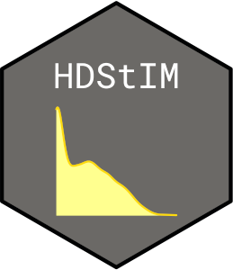

<!-- README.md is generated from README.Rmd. Please edit that file -->

# HDStIM 

<!-- badges: start -->

[](https://github.com/niaid/HDStIM/actions?query=workflow%3AR-CMD-check)
[](https://github.com/niaid/HDStIM/actions?query=workflow%3Apkgdown)
<!-- badges: end -->

The goal of this package is to identify response to a stimulant in
CyTOF/Flow cytometry stimulation assays by labeling cells as responded
or not based on an unsupervised high dimensional approach. Starting from
the annotated cell populations either through automated clustering such
as FlowSOM or traditional cell gating, the primary function `HDStIM()`
follows a heuristic approach to label cells as responding or
non-responding.

For a combination of cell population and stimulation type (e.g., CD127+
T-helper cells and interferon-alpha), `HDStIM()` starts by performing
k-means clustering on the combined set of cells from stimulated and
unstimulated samples. K-means clustering is performed on expression data
of all the state markers combined. Upon clustering using a contingency
table, a Fisher’s exact test determines the effect size and the
statistical significance of partitioning. Cells form the combinations
that pass the Fisher’s exact test are labelled as responding.

## Installation

You can install the released version of stimcellselector from
[CRAN](https://CRAN.R-project.org) with:

``` r
install.packages("HDStIM")
```

And the development version from [GitHub](https://github.com/) with:

``` r
# install.packages("devtools")
devtools::install_github("niaid/HDStIM")
```

## Contact

Rohit Farmer: <rohit.farmer@nih.gov>, <rohit.farmer@gmail.com>
